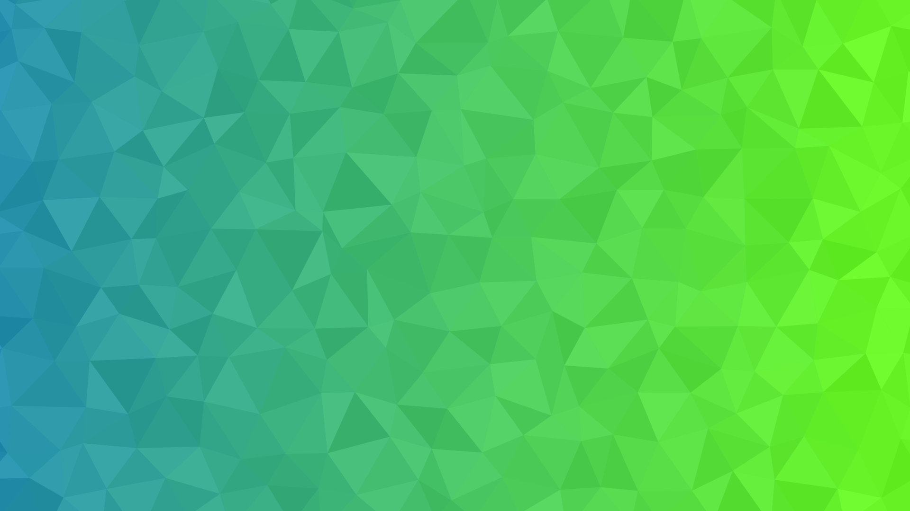

# svgcolortriangles
Create svg images with triangles using Python 3
```
Usage:
  python3 triangle.py > yourfile.svg

  The script loads the config.json settings. Its content is as follows:
  
  width = Width of the image
  height = Heigth of the image
  edge_len = Roughly the size of every triangle
  random_vertex = The max percentage of randomness of each point. High values mess things up
  max_color_offset = The max difference between original colors and randomized colors for each RGB channel
  left_color = Color on the left, must be written as #xxxxxx or xxxxxx
  right_color = Color on the right, must be written as #xxxxxx or xxxxxx
  uniform_mode = Set it to true to make the color randomizer affect only brightness of each triangle
  random_colors = Set it to true to force random left and right color
  Running:
  python3 triangle.py > example.svg
```
example.svg with above example

